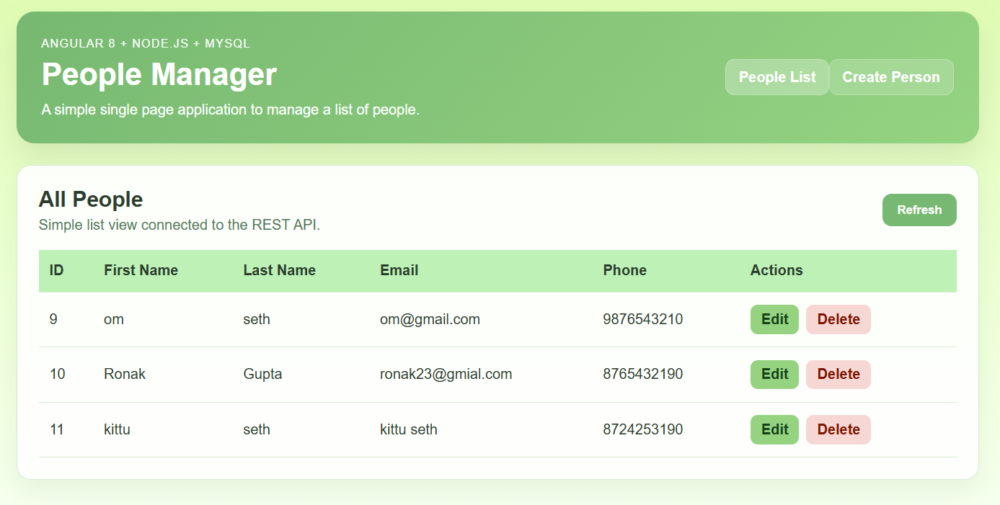
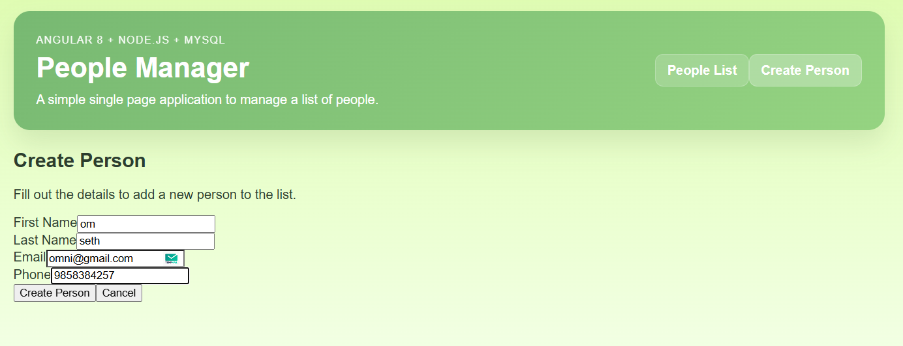
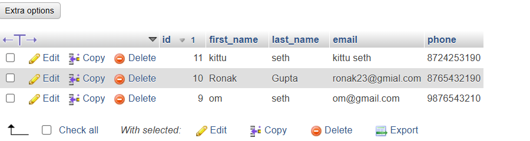

# 👥 People Manager (Angular 8 + Node.js + MySQL)

A sleek, robust, full-stack Single Page Application (SPA) designed to seamlessly manage a list of people with full end-to-end CRUD capabilities.

## ✨ Features
- **Frontend SPA**: Built with **Angular 8**. Features a reactive UI with intuitive navigation.
- **Backend API**: Powered by **Node.js** & **Express**. Robust RESTful endpoints.
- **Database**: Handled by **MySQL** for relational structured storage.
- **Operations Supported**: 
  - List all people
  - Create a new person
  - Edit an existing person
  - Delete a person
- **Design System**: A clean, green UI using a carefully crafted color palette:
  - `#84B179`, `#A2CB8B`, `#C7EABB`, `#E8F5BD`

---

## 📁 Project Structure

```text
people-manager-full/
├── frontend/       # Angular 8 Single Page App
├── backend/        # Node.js + Express API Server
├── database/       # Schema definitions and dummy seed data
└── README.md
```

---
## ScreenShots:



## 🚀 Step-by-Step Setup Guide (Windows / XAMPP)

Follow these instructions exactly to get the project working locally without any configuration headaches.

### 1. Database Setup (MySQL)
The simplest way to use MySQL on Windows is via **XAMPP**.
1. Download [XAMPP](https://www.apachefriends.org/index.html) and install it.
2. Open the **XAMPP Control Panel** and click **Start** next to **MySQL**.
3. Click the **Admin** button to open `phpMyAdmin` in your browser.
4. Click **New** on the left menu, enter `people_manager`, and click **Create**.
5. Select your new `people_manager` database, go to the **Import** tab at the top.
6. Click **Choose File** -> select the `database/schema.sql` file from this repository.
7. Click **Import** at the bottom. Your Database is now ready!

### 2. Backend Setup
1. Open a new Terminal and navigate to the backend folder:
   ```bash
   cd backend
   ```
2. Install Node modules:
   ```bash
   npm install
   ```
3. Your database connection string is already configured for XAMPP defaults inside `.env` (`DB_USER=root`, `DB_PASSWORD=`).
4. Start the backend Node API server:
   ```bash
   npm run dev
   ```
   *The Express server will start listening on `http://localhost:3000`.*

### 3. Frontend Setup
*Note: We have included a `.npmrc` file and updated scripts to automatically resolve older Angular 8 peer dependency issues on modern Node.js 17+ environments! You do not need any legacy flags!*

1. Open another Terminal and navigate to the frontend folder:
   ```bash
   cd frontend
   ```
2. Install Angular dependencies:
   ```bash
   npm install
   ```
3. Start the Angular application:
   ```bash
   npm start
   ```
   *The Angular project will quickly build and statically spawn at `http://localhost:4200`!*

Enjoy managing your people!
